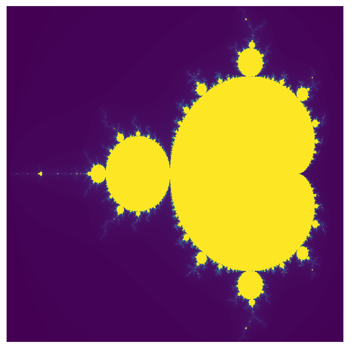

# Mandelbrot-Set

Python project to visualize the Mandelbrot Set.

Run `python3 Main.py resolution maxIterations` to generate a plot of the Mandelbrot Set, where `resolution` is the side length of the plot in pixels, and `maxIterations` specifies the maximum number of iterations used when calculating the elements of the Mandelbrot Set. 

### Sample output

